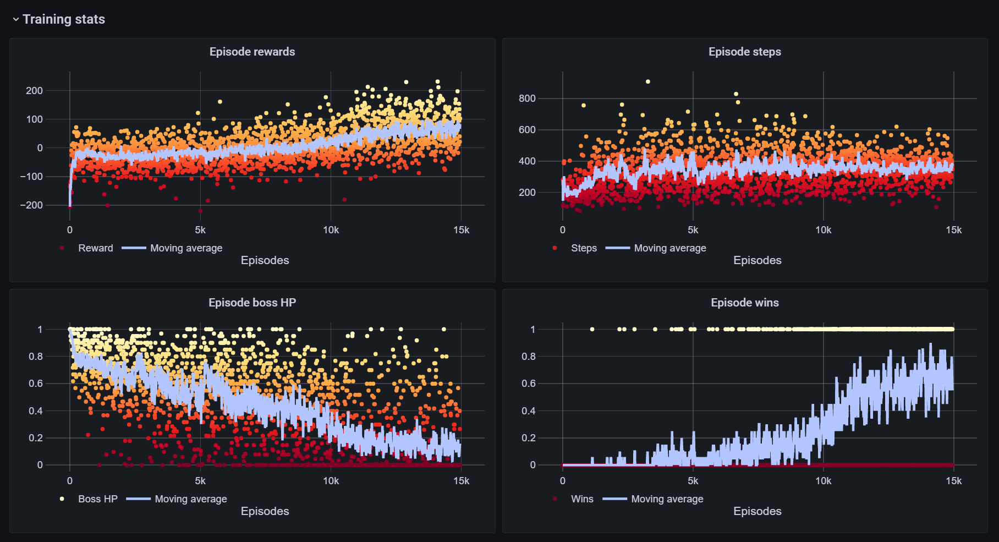
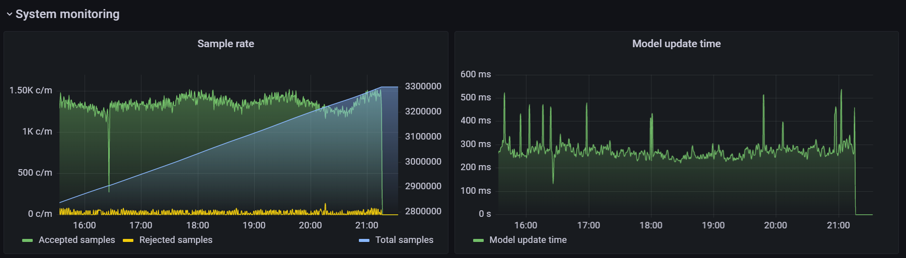

# SoulsAI

[](https://github.com/amacati/SoulsAI/actions/workflows/github-actions.yaml)   [](https://soulsai.readthedocs.io/en/latest/?badge=latest)

SoulsAI is a distributed reinforcement learning framework that allows users to train agents on the [SoulsGym](https://github.com/amacati/SoulsGym) environments. Since the achievable speed ups with SoulsGym environments are limited, SoulsAI enables improved training times by allowing multiple worker nodes to sample simultaneously. The generated samples are sent to a centralized server that trains the agents and broadcasts updates to the worker nodes. SoulsAI can of course be used to train agents on any environment, but it was specifically developed for this use case. Therefore, the following description assumes that the training environment is a SoulsGym. A more detailed description of this package can also be found in our [official docs](https://soulsai.readthedocs.io/en/latest/index.html).



- [Requirements](#requirements)
- [Installation](#installation)
- [Getting Started](#getting-started)
- [Available Algorithms](#available-algorithms)
- [Live Monitoring](#live-monitoring)
- [Testing the framework](#testing-the-framework)
- [Documentation](#documentation)

## Requirements

The requirements depend on whether you want to run a training client or a server.

### Client Requirements
You need to have the latest version of [SoulsGym](https://github.com/amacati/SoulsGym) installed. Consequently, Dark Souls III has to be installed since SoulsGym uses the game as engine for its environments. Dark Souls III is **not** available for free and has to be purchased (e.g. at the [Steam store](https://store.steampowered.com/app/374320/DARK_SOULS_III/)). Make sure you read the SoulsGym requirements before starting to train.

### Server Requirements
The training server is completely dockerized with docker-compose. Therefore, you need to install docker-compose on your machine. Furthermore, you need to ensure the that your machine accepts connections on port 6379. This is vital to allow the communication between the training nodes and external clients.

## Installation
To install SoulsAI, please download the full repository from this GitHub page.

For client installations, you also have to install all Python dependencies listed in the [environment file](environment.yaml). In addition, please make sure you have configured the correct address to your server in the [config file](config/config_d.yaml).

>**Note:** It is recommended to create a new *config.yaml* file in the config folder. This new file will overwrite any settings in the default config.

Clients only need to change the *redis_address* keyword, the rest of the configuration will be downloaded from the training server. If you run the training server in WSL2 on a machine that also samples, you can use *localhost* as address to connect to your local server.

For server installations, please run

```console
user@pc:~/SoulsAI$ docker compose --build
```

to build the docker images for the communication, training and telemetry node. Furthermore, you should create the *train_server_net* docker network by running 

```console
user@pc:~/SoulsAI$ docker network create train_server_net
```

If you also want to run the optional live monitoring dashboard with Grafana, you also need to create the *monitoring_net* network, and build the [monitoring server compose file](soulsai/distributed/server/monitoring/docker-compose.yaml).

In addition, for **both the client and the server** you have to create a file with a password for Redis. This file needs to be placed in the [config](config/) folder and has to be named *redis.secret*. Its content should be a single line reading

> requirepass xxx

where *xxx* is your server password. You can choose any password you want as long as they match on the server and the client.

### Install a WSL2 training server
If you are running the training server on WSL2 **and** want to connect with external clients, you have to set up the port forwarding. **In WSL2**, check the IP with 

```console
user@pc:~$ ifconfig
```

>**WARNING:** Do **NOT** use the WSL2 IP from Windows cmd ipconfig!

You then have to open cmd with admin privileges and forward port 6379 to WSL2 by executing

```console
C:\WINDOWS\system32> netsh interface portproxy add v4tov4 listenaddress=0.0.0.0 listenport=6379 connectaddress=<WSL2_IP> connectport=6379
```
where <WSL2_IP> is your WSL2 IP address. Finally, open the Windows firewall panel and create a new incoming rule for port 6379, allowing all connections to this port.

## Getting Started
Clients can start the training by running the [client main script](soulsai/distributed/client/main.py). The client will then connect to the training server and start the training.

Before you start the training server, please make sure you understand the contents of the training [config file](config/config_d.yaml), and then set your desired training configuration. Again, it is recommended to overwrite any settings by creating the *config.yaml* file.

Once you have configured your algorithm, start the docker containers with

```console
user@pc:~/SoulsAI$ docker compose up
```
from the repository root folder. If you also want to enable live monitoring, please make sure you enabled the monitoring in the config file, and then run the Grafana/Prometheus monitoring stack by launching the monitoring compose file

```console
user@pc:~/SoulsAI/soulsai/distributed/server/monitoring$ docker compose up
```

## Available Algorithms
At the moment, the DQN and PPO are the only available training algorithms. DQN runs in an asynchonous mode and accepts samples from clients that slightly lag behind the current model iteration. In this manner, clients can efficiently sample while continuously updating their agents in the background. PPO only supports a synchronous mode, and is not resilient to network issues, client disconnects etc.

## Live Monitoring
Since stability is a major issue when training with SoulsGym environments and training can take several days, we include a Grafana dashboard for live monitoring of agent performance and system health.



## Testing the framework
You can also easily test the full framework on a local machine by running dockerized clients with the LunarLander-v2 environment. The testing suite includes PPO and DQN. Algorithms can again be tailored by placing a *config.yaml* file in the [PPO](test/ppo/) or [DQN](test/dqn) test folder, respectively. The full framework can then be launched from the docker compose files in these folders. Note that you can scale clients directly by running multiple instances of the client container, e.g. for 2 clients training with DQN:

```console
user@pc:~/SoulsAI/test/dqn$ docker compose up --scale client_node=2
```

## Documentation
For details on the `soulsai` package see our [official docs](https://soulsai.readthedocs.io/en/latest/index.html).