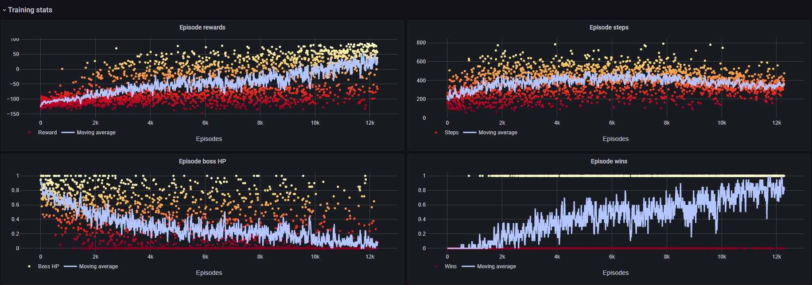

distributed.server
==================

.. toctree::
    :hidden:

    training_node/index
    telemetry_node/index

The server module contains nodes for training the agents, live telemetry, and a web interface.

The whole stack is dockerized to maximize the isolation of nodes and to make it easier to manage the
setup.

.. note::
    It is entirely possible to train on a single machine by configuring the server to run in WSL2.
    To do so, simply launch the server containers and set the required addresses in the
    configuration files to ``localhost``.

The core stack
~~~~~~~~~~~~~~

The core of the training server stack consists of the communication service node ``redis``,
the ``training_node`` and the ``telemetry_node``. Redis allows us to communicate with clients, via
messages and the data base. The training node actually trains the agents, and the telemetry node
aggregates the results to visualize the current training progress. These components are essential
for training

.. note::
    It is highly recommended to launch the server from its docker-compose file at the root of the
    repository! This ensures the proper mapping of volumes, networks, ports etc.

Redis
^^^^^
Redis runs in its own Docker container and is preconfigured to run as communication service for
external client nodes. 

.. note::
    To restrict access to Redis, both the server and the client have to add a *redis.secret* file in
    the config folder. This file should contain a single line reading

    .. code-block:: rst

        requirepass <xxx>
    
    where *<xxx>* is your Redis password. Please choose a password of sufficient length and make
    sure the password on your clients matches that of your server!

Training
^^^^^^^^
The main training node connects to Redis and receives the sample messages from clients. It then
updates the agent and broadcasts it to connected clients. Currently, the training nodes for DQN and
PPO are implemented.

Configuration
-------------
The training node is configured using the files in the config folder. By default, the 
*config_d.yaml* file contains all necessary arguments to run the server and clients. If you want to
change the training settings, you can add a *config.yaml* file to the config folder. Each entry in
this file will overwrite the respective default settings.

Checkpoints
-----------
On each training start, a unique folder is generated under the saves folder. It contains the
training configuration saved as a json file, the current node checkpoint, and the training
results for each episode. Every *n*-th iteration, the training node checkpoints its networks,
normalizers, replay buffers etc. to the experiment results folder.

During training, an additional subfolder for the best model is created. If the telemetry node
identifies the current model iteration as the best one yet, it sends a quicksave command to the
training node. This current best model is saved to the best model subfolder.

Finally, users may manually checkpoint the training node by running the *quicksave.py* script in the
script folder.

Telemetry
^^^^^^^^^
The telemetry node aggregates the training statistics and saves an updated figure of the results
every other episode. It also tracks the best average reward and sends checkpoint messages to the
training node when a better model has been found.

Grafana Connection
------------------
While the training figures are sufficient for a retrospective analysis, it can also be very helpful
to have live telemetry. This is particularly true due to the long training times of SoulsGym
environments. SoulsAI enables this via a Grafana instance. To display the current training
performance in Grafana, the telemetry node contains an adapter that acts as a Grafana data source.

Docker networks
^^^^^^^^^^^^^^^
All three core nodes communicate over the *train_server_net* Docker network. Clients can only
communicate with the nodes inside the network over Redis. To this end, port 6379 of the network is
exposed. You can create the network by running

.. code-block:: console

    $ docker network create train_server_net

Live monitoring
~~~~~~~~~~~~~~~
Since training can take quite some time and the hacks used in SoulsGym aren't 100% stable, we
integrate a live monitoring service to detect active clients, the current sampling rate, update
times, and the status of the server nodes. We also include the training results to check the agent's
performance.

Grafana
^^^^^^^
We use Grafana as a web interface for live monitoring of the training process. To plot the agent's
performance, we use the plotly integration and the custom Grafana connector from the telemetry node.

Prometheus
^^^^^^^^^^
Both the training node and the telemetry node are surveilled by Prometheus. In addition, it tracks
the number of active clients, the model update times, and the total sample count. This information
can then conveniently be displayed in Grafana.

Docker networks
^^^^^^^^^^^^^^^
The monitoring stack runs in its own docker compose environment. To reach the training and telemetry
server for live monitoring, the stack requires a second docker network, *server*.

Infrastructure
~~~~~~~~~~~~~~
If the server stack runs on an external machine, a few basic infrastructure functionalities are
required to make it reachable by its domain name, and to add SSL encryption. We use NGINX as reverse
proxy and certbot to renew the SSL certificates. Both services run in the reverse_proxy docker
compose environment.

A detailed tutorial on how to configure NGINX and certbot can be found
`here <https://mindsers.blog/post/https-using-nginx-certbot-docker/>`_.

Reverse Proxy
^^^^^^^^^^^^^
The NGINX container requires three volumes to be mapped correctly:

    * *nginx/conf*
    * *certbot/www*
    * *certbot/conf*

These paths have to point to the locations of the NGINX config folder, the certbot challenge files,
and the */etc/letsencrypt* folder, respectively.

Certbot
^^^^^^^
Certbot makes sure the SSL certificates are continuously updated. For more information about
Certbot, please have a look at `the official website <_https://certbot.eff.org/>`_.